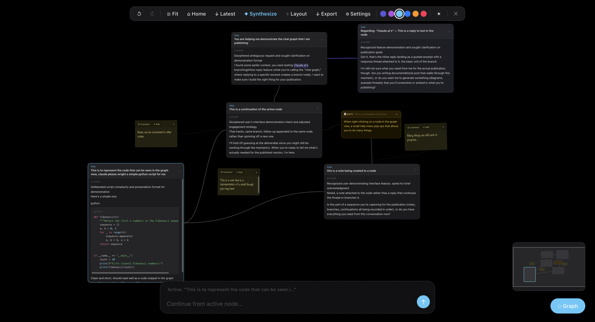

<div align="center">
  
  <h1>ChatGraph</h1>
  <p><strong>Turn Claude.ai's linear chat into a 2D spatial conversation graph.</strong></p>
</div>



## What is this?

Linear chat is a bad fit for non-linear thinking. The moment a conversation grows past a few exchanges, you start losing the thread — scrolling up to find the point where an idea forked, scrolling back down to find where you were, and watching the actual *structure* of your thinking flatten into one long column ordered by nothing but time.

ChatGraph is a Chrome extension that replaces that column with a full-screen, pannable, zoomable canvas. Every exchange with Claude becomes a node. Highlight any piece of a response, branch off it, and a new node spawns connected to that exact anchor point — its own thread you can keep pulling on, branch again, or leave alone. The graph is the conversation; you navigate it spatially instead of scrolling through it.

It works by reading the conversation straight out of Claude.ai's rendered page — there's no backend, no account, no server. The only other thing it needs is your own Anthropic API key, which is used for branch responses and (optionally) for everything else too.

## How it works

**The canvas.** Click the toggle button in the bottom-right corner of Claude.ai and the graph overlays the page. Drag to pan, scroll to zoom. A minimap in the corner shows where you are relative to the whole graph.

**Nodes and the active node.** Every back-and-forth becomes a node card. Exactly one node is "active" at any time, shown with a highlighted border — the bottom input bar always continues the conversation from whichever node is active. Click any other node to make it the active one instead.

**Branching.** Select a piece of text inside any node's response, and a small popup lets you branch from it. The new node is connected by a line back to the exact text you highlighted, and it carries a summarized chain of its parent context — not the entire original thread, just enough for Claude to know where the branch came from and where it's headed. Branches can branch again, with no depth limit.

**Two ways to send messages**, switchable from the popup:
- **Use Claude.ai directly** — ChatGraph types into Claude.ai's own input box and lets Claude.ai make the call. No API key needed for the main thread; branches still need one, since they happen off to the side rather than in Claude.ai's actual conversation.
- **Use your own API key** — every message and branch streams straight from the Anthropic API, called directly by the extension.

## Features

Beyond the core branching mechanic, the canvas includes:

- **Sticky notes** you can drop anywhere and tether to a node
- **Synthesize** — merge several nodes into a new summary node
- **Search** across all node text, with match cycling and highlighting
- **Undo/redo** for graph edits
- **Export** the graph as Markdown or JSON
- **Force-directed layout** to auto-declutter an overgrown graph, plus manual overlap resolution
- **Focus mode** to dim everything but the branch you're following
- **Node tags** (Explored / Dead end / Follow-up / Key insight) for marking up your own thinking
- **Manual connect lines** between any two nodes, with editable labels, independent of the branch tree
- **Light/dark theme** and a user-selectable accent color
- **Smart suggestions** for follow-up questions on a node
- Markdown rendering with syntax-highlighted, copy-button-equipped code blocks, built from scratch with no external dependencies

## Installing it

1. Clone or download this repo.
2. Open `chrome://extensions` in Chrome.
3. Turn on **Developer mode** (top-right toggle).
4. Click **Load unpacked** and select the repo folder.
5. Open Claude.ai. A small **⬡ Graph** button appears in the bottom-right corner — click it to open the canvas.
6. Click the extension's toolbar icon to open the popup, choose a send mode, and (if you want branches or full-API mode) paste in your Anthropic API key.

That's it — no build step required to use it. `content.js` is already built and ready to load.

## Project structure

```
manifest.json     MV3 manifest — permissions, content script, popup registration
content.js        The file Chrome actually loads — see "Why content.js is generated" below
popup.html        Extension popup: send-mode toggle + API key entry
styles.css        All canvas/node/UI styling
icons/            Toolbar and extension icons
src/              The real, maintained source — content.js is built from these
  markdown.js       Markdown → HTML parser + syntax highlighter
  state.js          Central state object, layout constants, color palettes
  scraper.js        Reads Claude.ai's DOM into node data, sanitizes scraped HTML
  renderer.js        Renders nodes/edges, layout, search, undo/redo, export, minimap, etc.
  api.js            Anthropic API calls, context-chain building, both send modes
  events.js         Pan/zoom/drag, branch-selector popup, keyboard shortcuts
  observer.js       MutationObserver wiring for new messages + SPA navigation resets
  init.js           Builds the overlay DOM and wires everything together on load
build.sh           Concatenates src/ into content.js, in dependency order
docs/              Concept doc and the screenshot above
.claude/           Custom Claude Code commands/skills used during development (optional, not required to run the extension)
```

### Why `content.js` is generated

Chrome's content-script loading doesn't give plain `<script>` files a clean way to share state without either a bundler or globals-via-concatenation, and this project deliberately uses neither npm nor a bundler — `build.sh` just concatenates the `src/` files in the order their dependencies require:

```
markdown.js → state.js → scraper.js → renderer.js → api.js → events.js → observer.js → init.js
```

`content.js` here is already built and current. You only need to run `bash build.sh` if you change something in `src/`, then reload the extension in `chrome://extensions`.

## A note on the DOM scraping

ChatGraph reads Claude.ai's rendered page directly, since a content script has no access to Claude.ai's actual server-side API calls. That means it depends on Claude.ai's current markup — `[data-testid="user-message"]` and `.font-claude-response` are the load-bearing selectors right now (see `src/scraper.js` and the breakdown in `CLAUDE.md`). If Claude.ai changes its DOM structure, scraping can break until the selectors are updated.

## What this isn't

- Not a new model — it's an interface. All the intelligence comes from Claude via your API key (or your existing Claude.ai session).
- Not multi-platform yet — v1 targets Claude.ai only.
- Not connected to any backend — everything runs client-side in the extension; your API key never leaves your browser except to talk to Anthropic's API directly.

## Roadmap

Explicitly out of scope for now, but the natural next steps: support for other chat UIs (ChatGPT, Gemini), a smarter context-summarization layer instead of the current static chain, saved/persistent graphs across sessions, and shared/collaborative graphs.

## License

All rights reserved — see [LICENSE](LICENSE). This repo is public so the code, architecture, and approach can be viewed, but no permission is granted to copy, install, run, modify, redistribute, or sell this software, in whole or in part, for any purpose, without explicit permission from the author.
